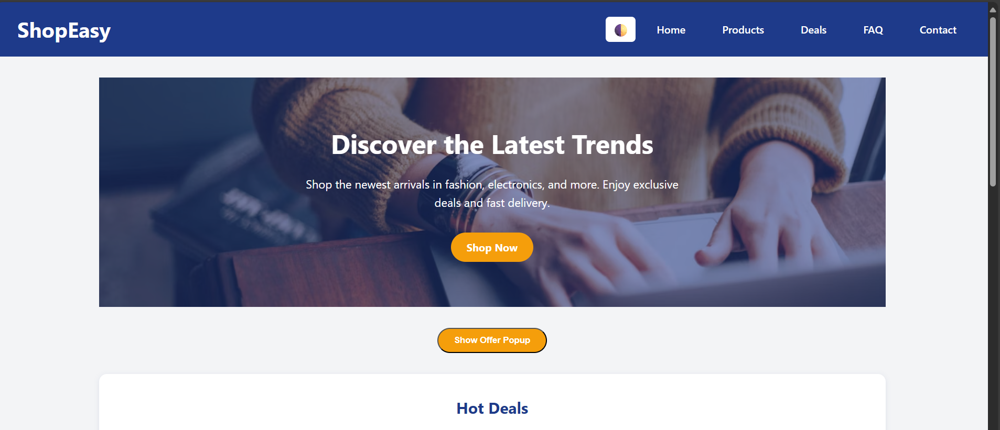
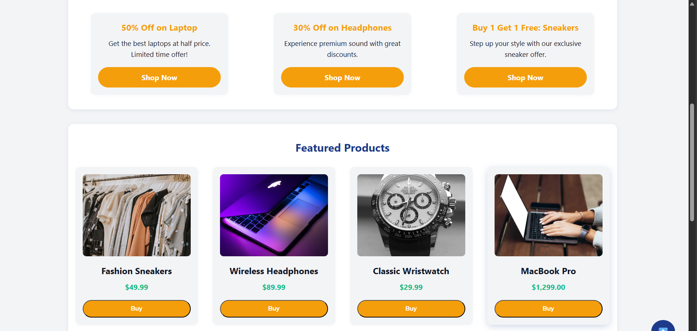
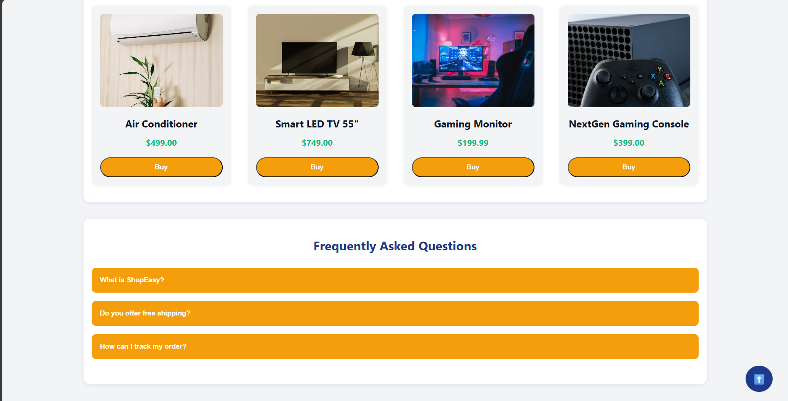

# ✨ Task 5 - UI Animation and Interactivity | Prism Studio Internship

This project enhances the previously built **ShopEasy landing page** with smooth animations, interactive visuals, and micro-interactions to deliver a more polished user experience.

---

## 📸 Screenshots

---

## ✅ Features Implemented

- 🎯 **Hover Effects** on buttons, links, and cards using CSS transitions.
- 🔁 **Smooth Transitions** for layout changes like the responsive navbar toggle.
- 👁️‍🗨️ **Scroll-Triggered Animations** using `IntersectionObserver` in JavaScript.
- 🪟 **Animated Modal Popup** with fade-in and slide-down effects.
- 🔄 **@keyframes Animation** for a bouncing arrow icon.
- 🌗 **Dark Mode Toggle** (existing feature retained).
- ⬆️ **Back to Top Button** with smooth scroll behavior.
- 📱 **Responsive Design** across devices.

---

## 💻 Tech Stack

- **HTML5**
- **CSS3 (custom variables & animations)**
- **JavaScript**

---

## 📂 How to Run

1. Clone or download the repository.
2. Open `index.html` in your browser.
3. Interact with the page:
   - Hover on buttons and links.
   - Scroll to see animated sections.
   - Click "Show Offer Popup" to open the modal.
   - Switch themes using the moon/sun icon.
   - Use the back-to-top button to scroll smoothly to the top.

---

## 👨‍💻 Author

**Maturi Pardha Saradhi**  
Web Development Intern | Prism Studio

---

## 📧 Contact

📩 psmaturi@gmail.com

---
